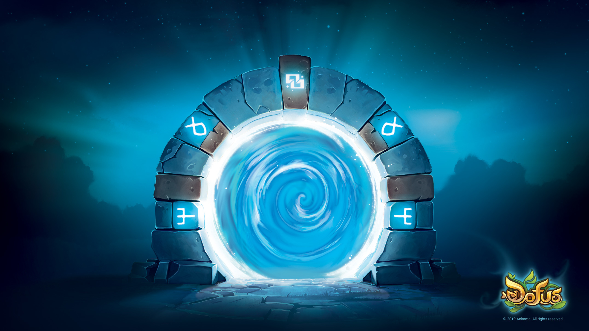

# Entre dans mon univers krosmique ! 🌟

---

  

---

## 🌍 À propos de moi 
- 🎮 Je m'appelle **Dylan Levant**, développeur **full stack** en formation chez **CODA**, passionné par le développement web et mobile.  
- 🌌 Mon travail s’inspire souvent des univers immersifs qui me fascinent, comme ceux d’**Ankama**, **Elden Ring**, ou encore **Warframe**.  
- 🚀 J’aime relever des défis techniques et concevoir des projets qui allient esthétique et performance.

---

## 💼 Ce que je peux apporter :
- 🎨 **Créativité et immersion :** Inspiré par des univers riches, je conçois des projets captivants et intuitifs.
- 🛠️ **Polyvalence technique :** Une maîtrise des outils modernes pour le développement web et mobile.
- 🤝 **Esprit collaboratif :** Habitué à travailler en équipe, je suis à l’écoute et toujours prêt à apprendre.

---

## 🎯 Mes objectifs actuels :
- Apprendre de nouvelles technologies comme **React Native** et **Node.js**.
- Participer à des projets open-source pour améliorer mes compétences en collaboration.
- Créer des applications innovantes et immersives, inspirées par les univers de jeux vidéo.

---

## 🛠️ Mes compétences :

  

---

## 📈 Mon activité GitHub :

  
  

---

## 🎯 Mes projets récents :

### **[Waven Build Manager](#)**  
> Une application web pour générer et partager des builds personnalisés.  

---

### **[Exilium Carnage](#)**  
> Un site communautaire pour gérer les membres et les événements d’un clan.  

---

### **[Focus Carot](#)**  
> Une application mobile pour organiser les tâches et gagner de l’XP.  

---

## 🌟 Ce qui me motive :
> Qu’il s’agisse de la stratégie d’un jeu comme **Warframe**, de la profondeur narrative d’**Elden Ring**, ou de la richesse visuelle d’**Ankama**, je m’efforce de recréer cette magie dans mes projets.

---

## 💬 Restons en contact :

  
  

---

## 🌌 Bonus : Mes inspirations

  
  
  

---

  

